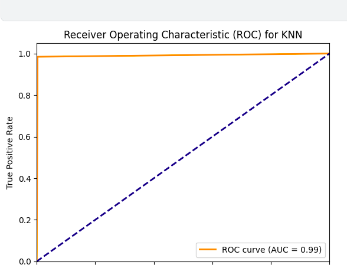

# Data Analyst Portfolio 

## Finance Analysis Dahboard in PowerBi

- Finance dataset extracted directly from PowerBi.
- "In this dashboard, I created a  data model to integrate the financial datasets, ensuring cohesive relationships between transactional details and sales metrics. By employing calculated columns and measures,I enabled a seamless flow of analysis from gross sales trends to profitability by time periods and geographies."
- Report Development: Expertise in designing, developing, and deploying business intelligence reports and dashboards that provide actionable insights.

- The model was meticulously optimized for query performance, facilitating instantaneous insights and supporting dynamic, user-driven interactivity across key financial performance indicators."
- 

## Diabetes Prediction

- Data Acquisition: The diabetes dataset was sourced from [Kaggle](https://www.kaggle.com/datasets/nanditapore/healthcare-diabetes/data).
- Advanced Modeling & Optimization: I demonstrated versatility by using machine learning algorithms such as Random Forest, Logistic Regression, and KNN, and optimized model performance using RandomizedSearchCV for hyperparameter tuning.
- Robust Model Evaluation: I Conducted thorough model evaluation using metrics like accuracy, precision, recall, F1-score, and ROC-AUC, showcasing a strong grasp of model validation techniques and the ability to effectively interpret and communicate results.

- 
  
For a more comprehensive understanding of my project,kindly [click here](https://www.kaggle.com/code/chikkychoc/notebook973d3c5b8a/input).

## Bike Sales

-  Data Cleaning and Transformation: Demonstrated expertise in data cleaning and transformation, successfully preprocessed a bike sales dataset to ensure data quality and integrity, enhancing the accuracy of subsequent analyses.
- Dashboard Development: I designed and implemented an interactive dashboard with slicers in Excel, providing insightful visualizations and enabling dynamic data exploration to drive business decisions in the bike sales industry.

[Kindly check out the full project here](https://github.com/stellatee19/Stellaprojects/blob/60f59a520196e724059b45441878632af11da116/Excel%20Project%20Dataset.xlsx)

### Education
- Certification - Google Data Analytics Certification
- Ms. Artificial Intelligence and Data Science ,Solent Southampton University - United Kingdom. (Dec. 2022)
- B.Eng: Computer Engineering , Covenant University - Nigeria (2015)

### Work Experience
Business data analyst,JETROE CLOUD - Canada (06/2023 - 12/2023)
- Enhanced data integrity and compliance by analyzing and interpreting web analytics, improving overall
data quality by 20%.
- Utilized advanced analytical techniques to identify and resolve operational disruptions, resulting in 25%
reduction in cloud environment challenges.
- Led the development and implementation of standardized cloud procedures, significantly increasing
efficiency throughout the software development life cycle.
