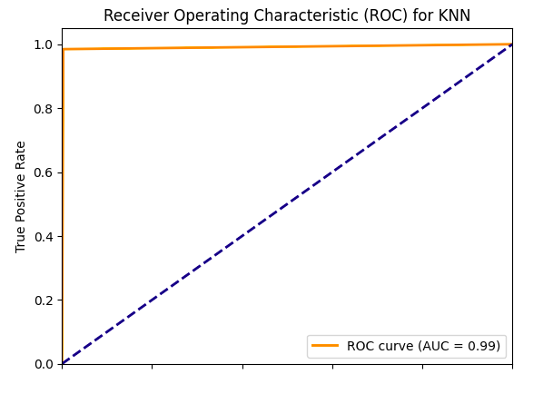
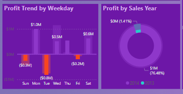
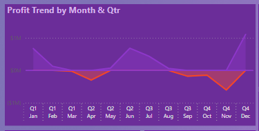

## Data Analyst Portfolio 

[Click Here To View My Resume](Assets/TemiCA.pdf)
### About me
I am a Passionate  data analyst with a proven track record of transforming complex datasets into actionable insights that drive business growth. Passionate about data visualization and predictive modeling, I leverage advanced analytical techniques to solve challenging problems. Let’s connect to explore opportunities and share industry insights.
### Skills
<code>Data Analaysis</code> |<code>PowerBI</code> | <code>MATLAB</code> | <code>Machine Learning</code> | <code>Python</code> | <code>SQL</code> | <code>Visualization</code> | <code>Presentation</code>

### Education
- *Solent Southampton University* - M.sc. AI & Data Science , 2021-2022
- *Covenant University* - B.Eng Computer Engineering, 2010-2015
- *Google Analytics Certificate*, 2023
  
## Projects
### Diabetes Prediction 
- Data Acquisition: The diabetes dataset was sourced from **[Kaggle](https://www.kaggle.com/datasets/nanditapore/healthcare-diabetes/data)**
- Advanced Modeling & Optimization: I demonstrated versatility by using machine learning algorithms such as Random Forest, Logistic Regression, and KNN, and optimized model performance using RandomizedSearchCV for hyperparameter tuning.
- Robust Model Evaluation: I Conducted thorough model evaluation using metrics like accuracy, precision, recall, F1-score, and ROC-AUC, showcasing a strong grasp of model validation techniques and the ability to effectively interpret and communicate result.

For a more comprehensive understanding of my project,kindly [click here](https://www.kaggle.com/code/chikkychoc/notebook973d3c5b8a/input).

### Finance Analysis Dahboard using PowerBI
- Finance dataset extracted directly from **PowerBI**
- I created a data model to integrate the financial datasets, ensuring cohesive relationships between transactional details and sales metrics. By employing calculated columns and measures,I enabled a seamless flow of analysis from gross sales trends to profitability by time periods and geographies."
- The model was meticulously optimized for query performance, facilitating instantaneous insights and supporting dynamic, user-driven interactivity across key financial performance indicators.

     

### Bike Sales
-  Data Cleaning and Transformation: Demonstrated expertise in data cleaning and transformation, successfully preprocessed a bike sales dataset to ensure data quality and integrity, enhancing the accuracy of subsequent analyses.
- Dashboard Development: I designed and implemented an interactive dashboard with slicers in Excel, providing insightful visualizations and enabling dynamic data exploration to drive business decisions in the bike sales industry.

[Kindly check out the full project here](https://github.com/stellatee19/Stellaprojects/blob/60f59a520196e724059b45441878632af11da116/Excel%20Project%20Dataset.xlsx)
